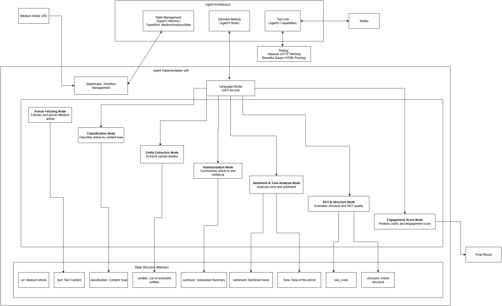

# Medium Article Analyzer 🚀

Following [this](https://medium.com/data-science-collective/the-complete-guide-to-building-your-first-ai-agent-its-easier-than-you-think-c87f376c84b2) tutorial

I'm improving the above idea, which is a basic AI Powered Text Analysis Agent into a comprehensive Medium Article Analyzer using LangGraph that can fetch, analyze, and provide insights on Medium articles.

## 🎯 Key Features

### Core Analysis

- 🔗 **URL Fetching**: Automatically fetch and parse Medium articles from URLs
- 📊 **Smart Classification**: Categorize articles into Medium-specific categories (Tech, Data Science, Business, etc.)
- 🏷️ **Advanced Entity Extraction**: Extract people, organizations, locations, and technologies mentioned
- 📝 **Intelligent Summarization**: Generate concise, meaningful summaries
- 💭 **Sentiment & Tone Analysis**: Detect article sentiment and writing tone

### Medium-Specific Features

- ⏱️ **Reading Time Analysis**: Extract and analyze Medium's reading time estimates
- 👏 **Engagement Metrics**: Track claps and engagement indicators
- 📈 **SEO Scoring**: Analyze titles and content for SEO optimization
- 🏗️ **Structure Analysis**: Examine article structure, headings, and formatting
- 🔧 **Technology Detection**: Identify programming languages, frameworks, and tools mentioned

### Advanced Capabilities

- 🔄 **Workflow Orchestration**: Uses LangGraph's state management for coordinated multi-step processing
- ⚡ **OpenAI Integration**: Powered by GPT-4o-mini for reliable and sophisticated analysis
- 🌐 **Web Scraping**: BeautifulSoup integration for robust content extraction

## 🛠️ Tech Stack

- **LangGraph** - Agent workflow orchestration and state management
- **LangChain** - LLM framework and prompt management
- **OpenAI GPT-4o-mini** - Language model for sophisticated text processing
- **BeautifulSoup4** - Web scraping and HTML parsing
- **Requests** - HTTP library for fetching Medium articles
- **Python-dotenv** - Environment variable management
- **Python** - Core implementation language

## 🎯 Use Cases

Perfect for:

- 📝 **Content Creators**: Analyze successful Medium articles for insights
- 📊 **Researchers**: Extract structured data from Medium publications
- 🚀 **Marketers**: Understand content performance and optimization opportunities
- 🤖 **Developers**: Learn from technical articles and track technology trends
- 📈 **Data Scientists**: Analyze writing patterns and engagement metrics

## 🚀 Getting Started

### Create the virtual environment

```bash
python -m venv agent_env
```

### Activate the virtual environment

**Windows:**

```bash
agent_env\Scripts\activate
```

**macOS/Linux:**

```bash
source agent_env/bin/activate
```

### Install the required dependencies

```bash
pip install -r requirements.txt
```

**Or install individually:**

- langgraph
- langchain
- langchain-openai
- python-dotenv
- beautifulsoup4
- requests

### Set up environment variables

Create a `.env` file in the project root:

```
OPENAI_API_KEY=your_openai_api_key_here
```

### Run the analyzer

```bash
python medium-agent.py
```

## 📦 Dependencies Management

### Save current dependencies

```bash
pip freeze > requirements.txt
```

## 🏗️ Architecture Overview

### Basic LangGraph Agent Architecture


### Medium Article Analyzer Agent Architecture



## 🔄 Workflow

The analyzer follows a structured workflow:

1. **🔗 Article Fetching**: Retrieves Medium article content from URL
2. **📊 Classification**: Categorizes the article into relevant topics
3. **🏷️ Entity Extraction**: Identifies key entities and technologies
4. **💭 Sentiment Analysis**: Determines tone and sentiment
5. **📈 SEO Analysis**: Evaluates SEO optimization potential
6. **🏗️ Structure Analysis**: Examines article organization
7. **📝 Summarization**: Creates comprehensive summary

## 🤝 Contributing

1. Fork the repository
2. Create a feature branch (`git checkout -b feature/amazing-feature`)
3. Commit your changes (`git commit -m 'Add amazing feature'`)
4. Push to the branch (`git push origin feature/amazing-feature`)
5. Open a Pull Request

## 📄 License

This project is licensed under the MIT License - see the [LICENSE](LICENSE) file for details.

## 🙏 Acknowledgments

- Original tutorial by [Data Science Collective](https://medium.com/data-science-collective/the-complete-guide-to-building-your-first-ai-agent-its-easier-than-you-think-c87f376c84b2)
- LangGraph and LangChain communities
- OpenAI for providing the GPT models
