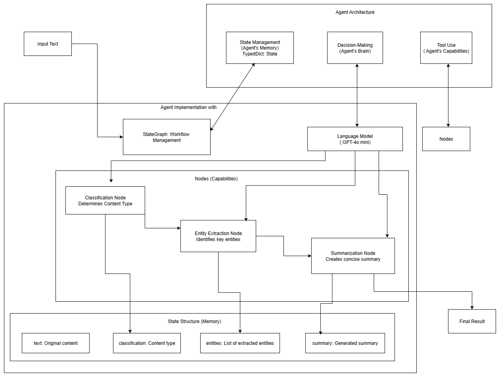

# Medium Article Analyzer

Following [this](https://medium.com/data-science-collective/the-complete-guide-to-building-your-first-ai-agent-its-easier-than-you-think-c87f376c84b2) tutorial

### Create the virtual environment

```bash
python -m venv agent_env
```

#### Activate the virtual environment

```bash
agent_env\Scripts\activate
```

### Install the following dependencies

- langgraph
- langchain
- langchain-openai
- python-dotenv

#### Save the dependencies in a txt

```bash
pip freeze > requirements.txt
```

## Overview of LangGraph's Agent Architecture


